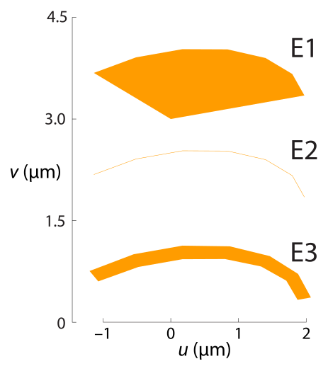

The Raith_element class
=======================

.. rubric:: Class overview:  :class:`Raith_element`

+---------------------+
| Properties (public) |
+=====================+
|                     |
+---------------------+

+---------+
| Methods |
+=========+
|         |
+---------+

.. class:: Raith_element

|RE| objects define low-level, unnamed patterns, collections of which are bundled together to form named structures in the GDSII library.

Properties
----------

.. attribute:: Raith_element.type

   String specifying type of element; allowed values are :matlab:`'polygon'`, :matlab:`'path'`, :matlab:`'dot'`, :matlab:`'arc'`, :matlab:`'circle'`, :matlab:`'ellipse'`, :matlab:`'text'`, :matlab:`'fbmspath'`, :matlab:`'fbmscircle'`, :matlab:`'sref'`, or :matlab:`'aref'`.

.. attribute:: Raith_element.data

   Structure array containing additional record data for element; allowed field names and typing of values are determined by the element type (see :numref:`§%s <Raith_element:Constructors>`).

Constructors
------------

.. code-block:: matlab

   E=Raith_element('polygon',layer,uv,DF)
   E=Raith_element('path',layer,uv,w,DF)
   E=Raith_element('dot',layer,uv,DF)
   E=Raith_element('arc',layer,uv_c,r,theta,angle,w,N,DF)
   E=Raith_element('circle',layer,uv_c,r,w,N,DF)
   E=Raith_element('ellipse',layer,uv_c,r,w,angle,N,DF)
   E=Raith_element('text',layer,uv_0,h,angle,uv_align,textlabel,DF)
   E=Raith_element('fbmspath',layer,uv,cvtr,w,DF)
   E=Raith_element('fbmscircle',layer,uv_c,r,w,DF)
   E=Raith_element('sref',name,uv_0[,mag[,angle[,reflect]]])
   E=Raith_element('aref',name,uv_0,n_colrow,a_colrow[,mag[,angle[,reflect]]])

The above constructors may be used to create |RE| objects. The first argument sets the element :attr:`type <Raith_element.type>` property, followed by a list of arguments comprising the fields of the :attr:`data <Raith_element.data>` property (a MATLAB structure array), which vary depend on the :attr:`type <Raith_element.type>`. Agruments shown in brackets are optional.
Alternately, an empty, argumentless |RE| object may be called, with the :attr:`type <Raith_element.type>` and :attr:`data <Raith_element.data>` properties assigned afterward. For example:

.. code-block:: matlab

   E=Raith_element;
   E.type='polygon';
   E.data.layer=0;
   E.data.uv=[0 1 1 0 0;0 0 1 1 0];
   E.data.DF=1.5;

The above is equivalent to

.. code-block:: matlab

   E=Raith_element('polygon',0,[0 1 1 0 0;0 0 1 1 0],1.5);

By default, all properties are checked for correctness (typing, allowed values, size) before being assigned, whether the |RE| object is created with a constructor or its properties are amended individually; this behaviour can be disabled if necessary (see :numref:`§%s <exttech:disabling data checking>`).

Descriptions of the eleven |RE| types are given in the following subsections.

Polygon element
^^^^^^^^^^^^^^^

:Description: Closed, filled polygon
:Constructor: :matlab:`E=Raith_element('polygon',layer,uv,DF)`
:Properties: + **type** --  :matlab:`'polygon'` (string)
             + **data.layer** -- GDSII layer (integer); allowed values are 0--63
             + **data.uv** -- 2 × *n* matrix [*u*;\ *v*] of polygon vertices (µm)
             + **data.DF** -- Dose factor for polygon

.. note::

   If the first and last vertices in :attr:`data.uv <Raith_element.data>` are not the same (i.e., an open polygon), :attr:`data.uv <Raith_element.data>` is amended to close the polygon and a warning is issued.

.. rubric:: Example
.. code-block:: matlab

   E=Raith_element('polygon',0,[0 2 2 1 1 0 0; ...
                                0 0 1 1 2 2 0],1.3);

.. _polygon_element:
.. figure:: images/polygon_element.svg
   :align: center
   :width: 500

   Example :matlab:`'polygon'` element

Path element
^^^^^^^^^^^^

:Description: Path of line segments
:Constructor: :matlab:`E=Raith_element('path',layer,uv,w,DF)`
:Properties: + **type** --  :matlab:`'path'` (string)
             + **data.layer** -- GDSII layer (integer); allowed values are 0--63
             + **data.uv** -- 2 × *n* matrix [*u*;\ *v*] of path vertices (µm)
             + **data.w** -- Width of path (µm); a value of zero yields single-pixel line; a negative value is considered to be the same as zero by the Raith NanoSuite software (single-pixel line)
             + **data.DF** -- Dose factor for path

.. note::

   The interpretation of a negative value for GDSII path WIDTH records differs between the Raith NanoSuite software and the standard GDSII specification.  In the former, a negative width is considered the same as zero width (single-pixel line); in the latter, a negative value denotes an *absolute* width, that is, a fixed width which is not affected by magnification of any parent structure (:matlab:`'sref'` or :matlab:`'aref'` elements).

.. rubric:: Example
.. code-block:: matlab

   E1=Raith_element('path',0,[0 0 1 1 2;1 0 0 1 1],0,1.3);
   E2=Raith_element('path',0,[0 0 1 1 2;1 0 0 1 1],0.2,1.3);

.. _path_element:
.. figure:: images/path_element.svg
   :align: center
   :width: 500

   Example :matlab:`'path'` elements. Element E1: :matlab:`data.w = 0`. Element E2: :matlab:`data.w = 0.2`.

Dot element
^^^^^^^^^^^

:Description: Single-pixel dot(s)
:Constructor: :matlab:`E=Raith_element('dot',layer,uv,DF)`
:Properties: + **type** --  :matlab:`'dot'` (string)
             + **data.layer** -- GDSII layer (integer); allowed values are 0--63
             + **data.uv** -- 2 × *n* matrix [*u*;\ *v*] of dot positions (µm)
             + **data.DF** -- Dose factor(s) for dot(s); if scalar, all dots given in :attr:`data.uv <Raith_element.data>` have the same dose factor; if vector, :attr:`data.DF <Raith_element.data>` must be the same length as :attr:`data.uv <Raith_element.data>` and specifies the dose factor of each dot

.. rubric:: Example
.. code-block:: matlab

   E1=Raith_element('dot',0,[0 2 2 0;0 0 1 1],1.3);
   E2=Raith_element('dot',0,[0 2 2 0;0 0 1 1],[0 0.5 1.0 1.5]);

.. _dot_element:

   Example :matlab:`'dot'` elements. Element E1: scalar :matlab:`data.DF`. Element E2: vector :matlab:`data.DF`.

Arc element
^^^^^^^^^^^

:Description: Segment of circular or elliptical path (Raith curved element)
:Constructor: :matlab:`E=Raith_element('arc',layer,uv_c,r,theta,angle,w,N,DF)`
:Properties: + **type** --  :matlab:`'arc'` (string)
             + **data.layer** -- GDSII layer (integer); allowed values are 0--63
             + **data.uv_c** -- Arc centre; 1 × 2 vector [*u*\ :sub:`c` \ *v*\ :sub:`c`] (µm)
             + **data.r** -- Radius of arc; may be scalar for a circular arc, or a 1 × 2 vector denoting semi-axes, [*a b*], for an elliptical arc (µm)
             + **data.theta** -- Starting and ending angles of arc with respect to axis defined by :attr:`data.angle <Raith_element.data>` argument, counter-clockwise positive; 1 × 2 vector [*θ*\ :sub:`1` *θ*\ :sub:`2`] (degrees)
             + **data.angle** -- Angle of rotation *ϕ* between positive *u*-axis and *θ* = 0 axis (degrees)
             + **data.w** -- Arc linewidth (µm); if empty, arc is a filled elliptical disc segment; if zero, arc is a single-pixel line; if non-zero, arc has a width (elliptical annulus sector); a negative value is considered to be the same as empty by the Raith NanoSuite software (filled elliptical disc segment)
             + **data.N** -- Number of vertices along arc length
             + **data.DF** -- Dose factor for arc

.. note::

   Arc elements are interpreted by the Raith NanoSuite software using the following parametric equations:

   .. math::

      u(\theta)=u_c+a\cos(\theta)\cos(\phi)-b\sin(\theta)\sin(\phi)

      v(\theta)=v_c+a\cos(\theta)\sin(\phi)+b\sin(\theta)\cos(\phi)

   with :math:`\theta\in[\theta_1,\theta_2]` spaced linearly over :attr:`data.N <Raith_element.data>` points.  As such, for elliptical arcs (i.e., :math:`a\not= b`), :math:`\theta` is a *parametric* angle, and does not in general correspond to the angle from the positive *u* axis (assuming :math:`\phi = 0`).  To convert between the polar angle from the ellipse centre :math:`\phi'` and the parametric angle :math:`\theta` required by :attr:`data.theta <Raith_element.data>`, use

   .. math:: \tan\theta=\frac{a}{b}\tan{\phi'}

   Note that :math:`\theta=\phi'` for multiples of 90° [1]_ .

   .. _arc_diagram:
   .. figure:: images/arc_diagram.svg
      :align: center
      :width: 500

      Angles used in :matlab:`'arc'` elements. For *a* = 2 and *b* = 1, :math:`\theta` = 120° corresponds to :math:`\phi'` = 139.1°.

.. rubric:: Example
.. code-block:: matlab

   E1=Raith_element('arc',0,[0 3],[2 1],[0 120],10,[],7,1.3);
   E2=Raith_element('arc',0,[0 1.5],[2 1],[0 120],10,0,7,1.3);
   E3=Raith_element('arc',0,[0 0],[2 1],[0 120],10,0.2,7,1.3);

.. _arc_element:

   Example :matlab:`'arc'` elements. Element E1: :matlab:`data.w = []`. Element E2: :matlab:`data.w = 0`. Element E3: :matlab:`data.w = 0.2`.

Circle element
^^^^^^^^^^^^^^

:Description: Circle or circular disc (Raith curved element)
:Constructor: :matlab:`E=Raith_element('circle',layer,uv_c,r,w,N,DF)`
:Properties: + **type** --  :matlab:`'circle'` (string)
             + **data.layer** -- GDSII layer (integer); allowed values are 0--63
             + **data.uv_c** -- Circle centre; 1 × 2 vector [*u*\ :sub:`c` \ *v*\ :sub:`c`] (µm)
             + **data.r** -- Radius of circle (µm)
             + **data.w** -- Circle linewidth (µm); if empty, circle is filled (disc); if zero, circle is a single-pixel line; if non-zero, circle has a width; a negative value is considered to be the same as empty by the Raith NanoSuite software (disc)
             + **data.N** -- Number of vertices along circle circumference
             + **data.DF** -- Dose factor for circle

.. rubric:: Example
.. code-block:: matlab

   E1=Raith_element('circle',0,[0 0],1,[],60,1.3);
   E2=Raith_element('circle',0,[3 0],1,0,60,1.3);
   E3=Raith_element('circle',0,[6 0],1,0.2,60,1.3);

.. _circle_element:
.. figure:: images/circle_element.svg
   :align: center
   :width: 500

   Example :matlab:`'circle'` elements. Element E1: :matlab:`data.w = []`. Element E2: :matlab:`data.w = 0`. Element E3: :matlab:`data.w = 0.2`.

Array reference element
^^^^^^^^^^^^^^^^^^^^^^^

:Description:  An array reference!

.. [1] See, e.g., `en.wikipedia.org/wiki/Ellipse <https://en.wikipedia.org/wiki/Ellipse>`_
