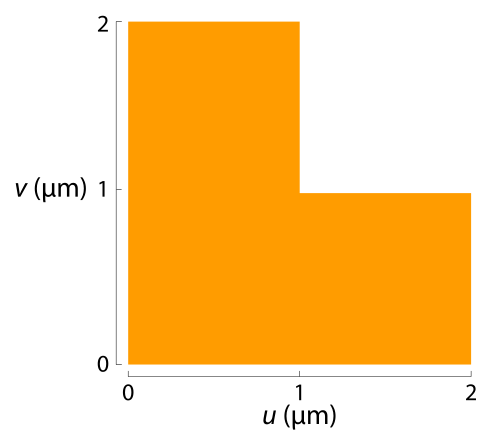
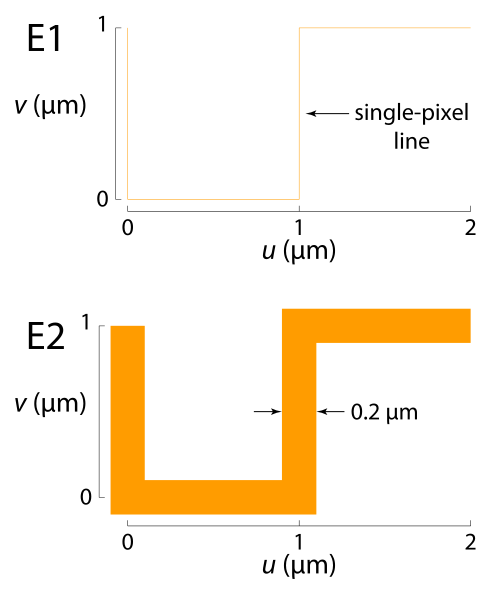
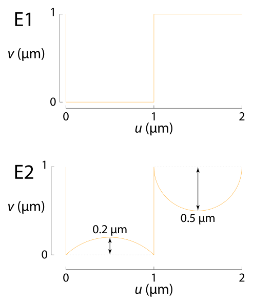

The Raith_element class
=======================

.. rubric:: Class overview:  :class:`Raith_element`

.. table::
   :widths: 1 2
   :width: 100%

   +----------------------------+-------------------------------------------------+
   | Properties (public)                                                          |
   +============================+=================================================+
   | :attr:`Raith_element.type` | Character array specifying type of element      |
   +----------------------------+-------------------------------------------------+
   | :attr:`Raith_element.data` | Structure with fields defining element geometry |
   +----------------------------+-------------------------------------------------+

.. table::
   :widths: 1 2
   :width: 100%

   +---------------------------------+-----------------------------------+
   | Methods                                                             |
   +=================================+===================================+
   | :meth:`Raith_element.plot`      | Plot element as filled polygons   |
   +---------------------------------+-----------------------------------+
   | :meth:`Raith_element.plotedges` | Plot element as unfilled polygons |
   +---------------------------------+-----------------------------------+

.. class:: Raith_element

|RE| objects define low-level, unnamed patterns, collections of which are bundled together to form named structures in the GDSII library.

Properties
----------

.. attribute:: Raith_element.type

   Character array specifying type of element; allowed values are :matlab:`'polygon'`, :matlab:`'path'`, :matlab:`'dot'`, :matlab:`'arc'`, :matlab:`'circle'`, :matlab:`'ellipse'`, :matlab:`'text'`, :matlab:`'fbmspath'`, :matlab:`'fbmscircle'`, :matlab:`'sref'`, or :matlab:`'aref'`.

.. attribute:: Raith_element.data

   Structure array containing additional record data for element; allowed field names and typing of values are determined by the element type (see :numref:`§%s <Raith_element:Constructors>`).

Constructors
------------

.. code-block:: matlab

   E=Raith_element('polygon',layer,uv,DF)
   E=Raith_element('path',layer,uv,w,DF)
   E=Raith_element('dot',layer,uv,DF)
   E=Raith_element('arc',layer,uv_c,r,theta,angle,w,N,DF)
   E=Raith_element('circle',layer,uv_c,r,w,N,DF)
   E=Raith_element('ellipse',layer,uv_c,r,w,angle,N,DF)
   E=Raith_element('text',layer,uv_0,h,angle,uv_align,textlabel,DF)
   E=Raith_element('fbmspath',layer,uv,cvtr,w,DF)
   E=Raith_element('fbmscircle',layer,uv_c,r,w,DF)
   E=Raith_element('sref',name,uv_0[,mag[,angle[,reflect]]])
   E=Raith_element('aref',name,uv_0,n_colrow,a_colrow[,mag[,angle[,reflect]]])

The above constructors may be used to create |RE| objects. The first argument sets the element :attr:`type <Raith_element.type>` property, followed by a list of arguments comprising the fields of the :attr:`data <Raith_element.data>` property (a MATLAB structure array), which vary depend on the :attr:`type <Raith_element.type>`. Agruments shown in brackets are optional.
Alternately, an empty, argumentless |RE| object may be called, with the :attr:`type <Raith_element.type>` and :attr:`data <Raith_element.data>` properties assigned afterward. For example:

.. code-block:: matlab

   E=Raith_element;
   E.type='polygon';
   E.data.layer=0;
   E.data.uv=[0 1 1 0 0;0 0 1 1 0];
   E.data.DF=1.5;

The above is equivalent to

.. code-block:: matlab

   E=Raith_element('polygon',0,[0 1 1 0 0;0 0 1 1 0],1.5);

By default, all properties are checked for correctness (typing, allowed values, size) before being assigned, whether the |RE| object is created with a constructor or its properties are amended individually; this behaviour can be disabled if necessary (see :numref:`§%s <exttech:disabling data checking>`).

Descriptions of the eleven |RE| types are given in the following subsections.

Polygon element
^^^^^^^^^^^^^^^

:Description: Closed, filled polygon
:Constructor: :matlab:`E=Raith_element('polygon',layer,uv,DF)`
:Properties: + **type** --  :matlab:`'polygon'` (character array)
             + **data.layer** -- GDSII layer (integer); allowed values are 0--63
             + **data.uv** -- 2 × *n* matrix [*u*;\ *v*] of polygon vertices (µm)
             + **data.DF** -- Dose factor for polygon

.. note::

   If the first and last vertices in :attr:`data.uv <Raith_element.data>` are not the same (i.e., an open polygon), :attr:`data.uv <Raith_element.data>` is amended to close the polygon and a warning is issued.

.. rubric:: Example
.. code-block:: matlab

   E=Raith_element('polygon',0,[0 2 2 1 1 0 0; ...
                                0 0 1 1 2 2 0],1.3);

.. _polygon_element:

   Example :matlab:`'polygon'` element

Path element
^^^^^^^^^^^^

:Description: Path of line segments
:Constructor: :matlab:`E=Raith_element('path',layer,uv,w,DF)`
:Properties: + **type** --  :matlab:`'path'` (character array)
             + **data.layer** -- GDSII layer (integer); allowed values are 0--63
             + **data.uv** -- 2 × *n* matrix [*u*;\ *v*] of path vertices (µm)
             + **data.w** -- Width of path (µm); a value of zero yields single-pixel line; a negative value is considered to be the same as zero by the |RNS| software (single-pixel line)
             + **data.DF** -- Dose factor for path

.. note::

   The interpretation of a negative value for GDSII path WIDTH records differs between the |RNS| software and the standard GDSII specification.  In the former, a negative width is considered the same as zero width (single-pixel line); in the latter, a negative value denotes an *absolute* width, that is, a fixed width which is not affected by magnification of any parent structure (:matlab:`'sref'` or :matlab:`'aref'` elements).

.. rubric:: Example
.. code-block:: matlab

   E1=Raith_element('path',0,[0 0 1 1 2;1 0 0 1 1],0,1.3);
   E2=Raith_element('path',0,[0 0 1 1 2;1 0 0 1 1],0.2,1.3);

.. _path_element:

   Example :matlab:`'path'` elements

   Element E1: :matlab:`data.w = 0`; Element E2: :matlab:`data.w = 0.2`

Dot element
^^^^^^^^^^^

:Description: Single-pixel dot(s)
:Constructor: :matlab:`E=Raith_element('dot',layer,uv,DF)`
:Properties: + **type** --  :matlab:`'dot'` (character array)
             + **data.layer** -- GDSII layer (integer); allowed values are 0--63
             + **data.uv** -- 2 × *n* matrix [*u*;\ *v*] of dot positions (µm)
             + **data.DF** -- Dose factor(s) for dot(s); if scalar, all dots given in :attr:`data.uv <Raith_element.data>` have the same dose factor; if vector, :attr:`data.DF <Raith_element.data>` must be the same length as :attr:`data.uv <Raith_element.data>` and specifies the dose factor of each dot

.. rubric:: Example
.. code-block:: matlab

   E1=Raith_element('dot',0,[0 2 2 0;0 0 1 1],1.3);
   E2=Raith_element('dot',0,[0 2 2 0;0 0 1 1],[0 0.5 1.0 1.5]);

.. _dot_element:
.. figure:: images/dot_element.svg
   :align: center
   :width: 500

   Example :matlab:`'dot'` elements

   Element E1: scalar :matlab:`data.DF`; Element E2: vector :matlab:`data.DF`

Arc element
^^^^^^^^^^^

:Description: Segment of circular or elliptical path (Raith curved element)
:Constructor: :matlab:`E=Raith_element('arc',layer,uv_c,r,theta,angle,w,N,DF)`
:Properties: + **type** --  :matlab:`'arc'` (character array)
             + **data.layer** -- GDSII layer (integer); allowed values are 0--63
             + **data.uv_c** -- Arc centre; 1 × 2 vector [*u*\ :sub:`c` \ *v*\ :sub:`c`] (µm)
             + **data.r** -- Radius of arc; may be scalar for a circular arc, or a 1 × 2 vector denoting semi-axes, [*a b*], for an elliptical arc (µm)
             + **data.theta** -- Starting and ending angles of arc with respect to axis defined by :attr:`data.angle <Raith_element.data>` argument, counter-clockwise positive; 1 × 2 vector [*θ*\ :sub:`1` *θ*\ :sub:`2`] (degrees)
             + **data.angle** -- Angle of rotation *ϕ* between positive *u*-axis and *θ* = 0 axis (degrees)
             + **data.w** -- Arc linewidth (µm); if empty, arc is a filled elliptical disc segment; if zero, arc is a single-pixel line; if non-zero, arc has a width (elliptical annulus sector); a negative value is considered to be the same as empty by the |RNS| software (filled elliptical disc segment)
             + **data.N** -- Number of vertices along arc length
             + **data.DF** -- Dose factor for arc

.. note::

   Arc elements are interpreted by the |RNS| software using the following parametric equations:

   .. math::

      u(\theta)=u_c+a\cos(\theta)\cos(\phi)-b\sin(\theta)\sin(\phi)

      v(\theta)=v_c+a\cos(\theta)\sin(\phi)+b\sin(\theta)\cos(\phi)

   with :math:`\theta\in[\theta_1,\theta_2]` spaced linearly over :attr:`data.N <Raith_element.data>` points.  As such, for elliptical arcs (i.e., :math:`a\not= b`), :math:`\theta` is a *parametric* angle, and does not in general correspond to the angle from the positive *u* axis (assuming :math:`\phi = 0`).  To convert between the polar angle from the ellipse centre :math:`\phi'` and the parametric angle :math:`\theta` required by :attr:`data.theta <Raith_element.data>`, use

   .. math:: \tan\theta=\frac{a}{b}\tan{\phi'}

   Note that :math:`\theta=\phi'` for multiples of 90°.\ [1]_

   .. _arc_diagram:
   .. figure:: images/arc_diagram.svg
      :align: center
      :width: 500

      Angles used in :matlab:`'arc'` elements. For *a* = 2 and *b* = 1, :math:`\theta` = 120° corresponds to :math:`\phi'` = 139.1°.

.. rubric:: Example
.. code-block:: matlab

   E1=Raith_element('arc',0,[0 3],[2 1],[0 120],10,[],7,1.3);
   E2=Raith_element('arc',0,[0 1.5],[2 1],[0 120],10,0,7,1.3);
   E3=Raith_element('arc',0,[0 0],[2 1],[0 120],10,0.2,7,1.3);

.. _arc_element:
.. figure:: images/arc_element.svg
   :align: center
   :width: 500

   Example :matlab:`'arc'` elements

   Element E1: :matlab:`data.w = []`; Element E2: :matlab:`data.w = 0`; Element E3: :matlab:`data.w = 0.2`

Circle element
^^^^^^^^^^^^^^

:Description: Circle or circular disc (Raith curved element)
:Constructor: :matlab:`E=Raith_element('circle',layer,uv_c,r,w,N,DF)`
:Properties: + **type** --  :matlab:`'circle'` (character array)
             + **data.layer** -- GDSII layer (integer); allowed values are 0--63
             + **data.uv_c** -- Circle centre; 1 × 2 vector [*u*\ :sub:`c` \ *v*\ :sub:`c`] (µm)
             + **data.r** -- Radius of circle (µm)
             + **data.w** -- Circle linewidth (µm); if empty, circle is filled (disc); if zero, circle is a single-pixel line; if non-zero, circle has a width; a negative value is considered to be the same as empty by the |RNS| software (disc)
             + **data.N** -- Number of vertices along circle circumference
             + **data.DF** -- Dose factor for circle

.. rubric:: Example
.. code-block:: matlab

   E1=Raith_element('circle',0,[0 0],1,[],60,1.3);
   E2=Raith_element('circle',0,[3 0],1,0,60,1.3);
   E3=Raith_element('circle',0,[6 0],1,0.2,60,1.3);

.. _circle_element:

   Example :matlab:`'circle'` elements

   Element E1: :matlab:`data.w = []`; Element E2: :matlab:`data.w = 0`; Element E3: :matlab:`data.w = 0.2`

Ellipse element
^^^^^^^^^^^^^^^

:Description: Ellipse or elliptical disk (Raith curved element)
:Constructor: :matlab:`E=Raith_element('ellipse',layer,uv_c,r,w,angle,N,DF)`
:Properties: + **type** --  :matlab:`'ellipse'` (character array)
             + **data.layer** -- GDSII layer (integer); allowed values are 0--63
             + **data.uv_c** -- Ellipse centre; 1 × 2 vector [*u*\ :sub:`c` \ *v*\ :sub:`c`] (µm)
             + **data.r** -- Semi-axes of ellipse; 1 × 2 vector [*a b*] (µm); *a* corresponds to the semi-axis in the :attr:`data.angle <Raith_element.data>` direction
             + **data.w** -- Ellipse linewidth (µm); if empty, ellipse is filled (elliptical disc); if zero, ellipse is a single-pixel line; if non-zero, ellipse has a width; a negative value is considered to be the same as empty by the |RNS| software (elliptical disc)
             + **data.angle** -- Angle of rotation *ϕ* between positive *u*-axis and *a* semi-axis (degrees)
             + **data.N** -- Number of vertices along ellipse circumference
             + **data.DF** -- Dose factor for ellipse

.. rubric:: Example
.. code-block:: matlab

   E1=Raith_element('ellipse',0,[0 6],[2 1],[],10,60,1.3);
   E2=Raith_element('ellipse',0,[0 3],[2 1],0,10,60,1.3);
   E3=Raith_element('ellipse',0,[0 0],[2 1],0.2,10,60,1.3);

.. _ellipse_element:

   Example :matlab:`'ellipse'` elements

   Element E1: :matlab:`data.w = []`; Element E2: :matlab:`data.w = 0`; Element E3: :matlab:`data.w = 0.2`

Text element
^^^^^^^^^^^^

:Description: Text rendered as simple polygons
:Constructor: :matlab:`E=Raith_element('text',layer,uv_0,h,angle,uv_align,textlabel,DF)`
:Properties: + **type** --  :matlab:`'text'` (character array)
             + **data.layer** -- GDSII layer (integer); allowed values are 0--63
             + **data.uv_0** -- Text anchor point; 1 × 2 vector [*u*\ :sub:`0` \ *v*\ :sub:`0`] (µm)
             + **data.h** -- Height of capital letters (µm)
             + **data.angle** -- Angle of rotation of text with respect to positive *u*-axis (degrees)
             + **data.uv_align** -- Alignment of text with respect to anchor point; 1 × 2 vector [*u*\ :sub:`align` \ *v*\ :sub:`align`]; allowed values are 0 (left/top), 1 (centre), and 2 (right/bottom), as follows (the + symbols denote the text anchor points):

                .. image:: images/text_uv_align.svg

             + **data.textlabel** -- Text to be written (character array).  The allowed characters, shown as rendered, are:

                .. image:: images/text_chars.svg

                in addition to the space character ( ). When rendered, text is kerned using a lookup table (text is not fixed width).

                .. attention::

                   Use Unicode character `U+00B5 <https://util.unicode.org/UnicodeJsps/character.jsp?a=00B5>`_ to enter the letter "µ" in :attr:`data.textlabel <Raith_element.data>`.  Other similar characters (e.g., `U+03BC <https://util.unicode.org/UnicodeJsps/character.jsp?a=03BC>`_, `U+1D6CD <https://util.unicode.org/UnicodeJsps/character.jsp?a=1D6CD>`_, `U+1D707 <https://util.unicode.org/UnicodeJsps/character.jsp?a=1D707>`_, `U+1D741 <https://util.unicode.org/UnicodeJsps/character.jsp?a=1D741>`_, `U+1D77B <https://util.unicode.org/UnicodeJsps/character.jsp?a=1D77B>`_, `U+1D7B5 <https://util.unicode.org/UnicodeJsps/character.jsp?a=1D7B5>`_) will result in an error.

             + **data.DF** -- Dose factor for text

.. note::

   A `simply connected <https://en.wikipedia.org/wiki/Simply_connected_space>`_ font is used in |RE| :matlab:`'text'` elements to avoid the problem of symbol segments being released during a sacrificial layer etch. As an example, consider etching the letter "A" through the device layer of a silicon-on-insulator chip. In the default |RNS| font, the triangular centre of the letter "A" is not connected to the surrounding plane. If the underlying buried oxide layer was subsequetly etched away isotropically for sufficiently long (e.g., in buffered-oxide etch), the central triangle would be released, potentially landing on a critical feature of the chip. A letter "A" rendered as a |RE| :matlab:`'text'` element does not encounter this problem due to its simply connected nature. The |RE| :matlab:`'text'` element font is inspired by the `Geogrotesque <https://emtype.net/fonts/geogrotesque>`_ and `Geogrotesque Stencil <https://emtype.net/fonts/geogrotesque-stencil>`_ fonts.

   .. _A_comparison:
   .. figure:: images/A_comparison.svg
      :align: center
      :width: 500

      Comparison between letter "A" rendered using the |RNS| default font (left) and |RE| font (right)

.. rubric:: Example
.. code-block:: matlab

   E=Raith_element('text',0,[0 0],1,30,[1 1],'Raith_GDSII',1.3);

.. _text_element:
.. figure:: images/text_element.svg
   :align: center
   :width: 500

   Example :matlab:`'text'` element

FBMS path element
^^^^^^^^^^^^^^^^^

:Description: Path of fixed beam moving stage (FBMS/*traxx*) line segments or arcs
:Constructor: :matlab:`E=Raith_element('fbmspath',layer,uv,cvtr,w,DF)`
:Properties: + **type** --  :matlab:`'fbmspath'` (character array)
             + **data.layer** -- GDSII layer (integer); allowed values are 0--63
             + **data.uv** -- 2 × *n* matrix [*u*;\ *v*] of |FBMS| path vertices (µm)
             + **data.cvtr** -- Curvature of |FBMS| path segments (µm); if scalar and zero, the path comprises line segments (no curvature); if a 1 × *n* vector, :matlab:`data.cvtr(k)` yields a circular arc with chord endpoints of :matlab:`data.uv(:,k-1)` and :matlab:`data.uv(:,k)` such that the radial distance between the arc and the chord centre is :matlab:`data.cvtr(k)`; a positive (negative) value of :matlab:`data.cvtr(k)` corresponds to an arc to the left (right) of the chord; the value of :matlab:`data.cvtr(1)` is ignored if :matlab:`data.cvtr(k)` is 1 × *n*
             + **data.w** -- Width of |FBMS| path (µm); a value of zero yields single-pixel line; a negative value is considered to be the same as zero by the |RNS| software (single-pixel line)
             + **data.DF** -- Dose factor for |FBMS| path

.. rubric:: Example
.. code-block:: matlab

   E1=Raith_element('fbmspath',0,[0 0 1 1 2;1 0 0 1 1],0,0,1.3);
   E2=Raith_element('fbmspath',0,[0 0 1 1 2;1 0 0 1 1],[0 0 0.2 0 -0.5],0,1.3);

.. _fbmspath_element:

   Example :matlab:`'fbmspath'` elements

   Element E1: :matlab:`data.cvtr = 0`; Element E2: :matlab:`data.cvtr = [0 0 0.2 0 -0.5]`

FBMS circle element
^^^^^^^^^^^^^^^^^^^

:Description: Fixed beam moving stage (FBMS/*traxx*) circle
:Constructor: :matlab:`E=Raith_element('fbmscircle',layer,uv_c,r,w,DF)`
:Properties: + **type** --  :matlab:`'fbmscircle'` (character array)
             + **data.layer** -- GDSII layer (integer); allowed values are 0--63
             + **data.uv_c** -- |FBMS| circle centre; 1 × 2 vector [*u*\ :sub:`c` \ *v*\ :sub:`c`] (µm)
             + **data.r** -- Radius of |FBMS| circle (µm)
             + **data.w** --  |FBMS| circle linewidth (µm); if zero, circle is a single-pixel line; if non-zero, circle has a width
             + **data.DF** -- Dose factor for |FBMS| circle

.. rubric:: Example
.. code-block:: matlab

   E1=Raith_element('fbmscircle',0,[0 0],1,0,1.3);
   E2=Raith_element('fbmscircle',0,[3 0],1,0.2,1.3);

.. _fbmscircle_element:

   Example :matlab:`'fbmscircle'` elements

   Element E1: :matlab:`data.w = 0`; Element E2: :matlab:`data.w = 0.2`

Structure reference element
^^^^^^^^^^^^^^^^^^^^^^^^^^^

:Description: Reference to a named structure, with optional transformations
:Constructor: :matlab:`E=Raith_element('sref',name,uv_0[,mag[,angle[,reflect]]])`
:Properties: + **type** --  :matlab:`'sref'` (character array)
             + **data.name** -- Name of structure being referenced (character array)
             + **data.uv_0** -- Structure origin; 1 × 2 vector [*u*\ :sub:`0` \ *v*\ :sub:`0`] (µm)
             + **data.mag** -- Magnification (uniform scaling) factor [optional]; default is no magnification (:attr:`data.mag <Raith_element.data>` = 1)
             + **data.angle** --  Angle of rotation with respect to origin, counter-clockwise positive (degrees) [optional]; default is no rotation (:attr:`data.angle <Raith_element.data>` = 0)
             + **data.reflect** --  Boolean flag (0 or 1) for reflecting about *u*-axis before other transformations [optional]; default is no reflection (:attr:`data.reflect <Raith_element.data>` = 0)

.. note::

   Transformations are applied in the following order: 1. scaling, mirroring; 2. rotation; 3. translation.

   .. _sref_transformations:
   .. figure:: images/sref_transformations.svg
      :align: center
      :width: 500

      :matlab:`'sref'` element transformations. :attr:`data.uv_0 <Raith_element.data>` values for the transformed structures are marked with + signs.

      A: Structure being referenced; B: :matlab:`data.mag = 2`; C: :matlab:`data.reflect = 1`; D: :matlab:`data.angle = 10`

.. attention::

   When :matlab:`'sref'` elements are plotted using the :meth:`Raith_element.plot` method, the origin is marked with a :red:`+` sign, labelled with :attr:`data.name <Raith_element.data>`:  since the structure being referenced is not part of the |RE| :matlab:`'sref'` object itself, the full hierarchy cannot be plotted.  To view the full hierarchy, the structure must be plotted using the :meth:`Raith_library.plot` method.

.. rubric:: Example
.. code-block:: matlab

   E=Raith_element('sref','foo',[10 20],2,30);

.. _sref_element:

   Example :matlab:`'sref'` element, as plotted using the :meth:`Raith_element.plot` method

Array reference element
^^^^^^^^^^^^^^^^^^^^^^^

:Description: Rectangular array of named structures, with optional transformations

:Constructor: :matlab:`E=Raith_element('aref',name,uv_0,n_colrow,a_colrow[,mag[,angle[,reflect]]])`
:Properties: + **type** --  :matlab:`'aref'` (character array)
             + **data.name** -- Name of structure being referenced (character array)
             + **data.uv_0** -- Structure origin; 1 × 2 vector [*u*\ :sub:`0` \ *v*\ :sub:`0`] (µm)
             + **data.n_colrow** -- Number of columns and rows in array; 1 × 2 vector [*n*\ :sub:`columns` \ *n*\ :sub:`rows`]
             + **data.a_colrow** -- Pitch of columns and rows; 1 × 2 vector [*a*\ :sub:`columns` \ *a*\ :sub:`rows`] (µm)
             + **data.mag** -- Magnification (uniform scaling) factor [optional]; default is no magnification (:attr:`data.mag <Raith_element.data>` = 1)
             + **data.angle** --  Angle of rotation with respect to origin, counter-clockwise positive (degrees) [optional]; default is no rotation (:attr:`data.angle <Raith_element.data>` = 0)
             + **data.reflect** --  Boolean flag (0 or 1) for reflecting about *u*-axis before other transformations [optional]; default is no reflection (:attr:`data.reflect <Raith_element.data>` = 0)

.. note::

   Transformations are applied in the following order: 1. scaling, mirroring; 2. rotation; 3. translation.

.. attention::

   When :matlab:`'aref'` elements are plotted using the :meth:`Raith_element.plot` method, the origins of the instances are marked with :red:`+` signs, labelled with :attr:`data.name <Raith_element.data>`:  since the structure being referenced is not part of the |RE| :matlab:`'aref'` object itself, the full hierarchy cannot be plotted.  To view the full hierarchy, the structure must be plotted using the :meth:`Raith_library.plot` method.

.. rubric:: Example
.. code-block:: matlab

   E=Raith_element('aref','foo',[10 20],[4 3],[3 2],[],30);

.. _aref_element:
.. figure:: images/aref_element.svg
   :align: center
   :width: 500

   Example :matlab:`'aref'` element, as plotted using the :meth:`Raith_element.plot` method

.. attention::

   It is important to note that the |RNS| software interprets GDSII AREF elements differently than the GDSII specification suggests.  In particular, NanoSuite applies rotation operations *both* to the structures being referenced and the lattice vectors defining the rectangular array.  In contrast, the GDSII specification applies the rotation only to the structures; the lattice of origins for the referenced structures are fully specified using the number of rows and columns in addition to three anchor points which are calculated *after* all transformations have been applied.  This variation in interpretation can result in identical AREF elements appearing differently when viewed using the |RNS| software versus other GDSII editors, such as `KLayout <https://klayout.de/>`_; the following two figures illustrate this behaviour.

.. _Raith_foo-aref:

   Raith interpretation of the AREF element in :numref:`aref_element`, for an L-shaped structure named :matlab:`'foo'`

.. _KLayout_foo-aref:

   KLayout interpretation of the AREF element in :numref:`aref_element`, for an L-shaped structure named :matlab:`'foo'`

Methods
-------

.. method:: Raith_element.plot([M[,scDF]])

   Plot |RE| object with default :ref:`Raith dose factor colouring <RaithDF>`. Elements are displayed as filled polygons, where applicable (:matlab:`'polygon'`; :matlab:`'path'` with non-zero :attr:`data.w <Raith_element.data>`; :matlab:`'arc'`, :matlab:`'circle'`, and :matlab:`'ellipse'` with empty :attr:`data.w <Raith_element.data>`; :matlab:`'text'`).

   :Arguments: + **M** -- Augmented transformation matrix to be applied to element [optional]; see :meth:`Raith_library.trans`,   :meth:`Raith_library.rot`, :meth:`Raith_library.refl`, and :meth:`Raith_library.scale`.
               + **scDF** -- Overall multiplicative scaling factor for dose factor specified in :attr:`data.DF <Raith_element.data>` [optional]

   :Returns: None

   .. _RaithDF:
   .. figure:: images/RaithDF.svg
      :align: center
      :width: 500

      Default Raith dose factor colourmap

   Calling :meth:`Raith_element.plot` does not change the current axis scaling; issue an :matlab:`axis equal` command to ensure that the element is displayed in the figure correctly.

   .. note::

      Normally, :meth:`Raith_element.plot` is called without arguments, to display the |RE| object as it would appear in the |RNS| software. The optional arguments **M** and **scDF** are used internally, when :meth:`Raith_element.plot` is called by :meth:`Raith_structure.plot`, :meth:`Raith_library.plot`, or :meth:`Raith_positionlist.plot`.

   .. rubric:: Example
   .. code-block:: matlab

      E=Raith_element('text',0,[0 0],1,0,[0 2],'B',1.3);
      E.plot;
      axis equal;

   .. _RE_plot:
   .. figure:: images/RE_plot.svg
      :align: center
      :width: 500

      Text element plotted using the :meth:`Raith_element.plot` method

.. method:: Raith_element.plotedges([M[,scDF]])

   Plot |RE| object outlines with default :ref:`Raith dose factor colouring <RaithDF>`. Elements are displayed as unfilled polygons, where applicable (:matlab:`'polygon'`; :matlab:`'path'` with non-zero :attr:`data.w <Raith_element.data>`; :matlab:`'arc'`, :matlab:`'circle'`, and :matlab:`'ellipse'` with empty :attr:`data.w <Raith_element.data>`; :matlab:`'text'`).

   :Arguments: + **M** -- Augmented transformation matrix to be applied to element [optional]; see :meth:`Raith_library.trans`,   :meth:`Raith_library.rot`, :meth:`Raith_library.refl`, and :meth:`Raith_library.scale`.
               + **scDF** -- Overall multiplicative scaling factor for dose factor specified in :attr:`data.DF <Raith_element.data>` [optional]

   :Returns: None

   Calling :meth:`Raith_element.plotedges` does not change the current axis scaling; issue an :matlab:`axis equal` command to ensure that the element is displayed in the figure correctly.

   .. note::

      Normally, :meth:`Raith_element.plotedges` is called without arguments. The optional arguments **M** and **scDF** are used internally, when :meth:`Raith_element.plotedges` is called by :meth:`Raith_structure.plotedges`, :meth:`Raith_library.plotedges`, or :meth:`Raith_positionlist.plotedges`.

   .. rubric:: Example
   .. code-block:: matlab

      E=Raith_element('text',0,[0 0],1,0,[0 2],'B',1.3);
      E.plotedges;
      axis equal;

   .. _RE_plotedges:
   .. figure:: images/RE_plotedges.svg
      :align: center
      :width: 500

      Text element plotted using the :meth:`Raith_element.plotedges` method

.. [1] See, e.g., `en.wikipedia.org/wiki/Ellipse <https://en.wikipedia.org/wiki/Ellipse>`_
