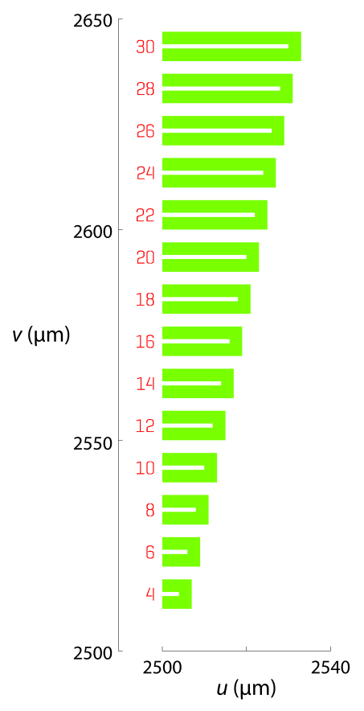

Quick-start guide
=================

As a simple example, let us construct a pattern of a cantilever for use with a positive-tone resist (e.g,. ZEP, PMMA), perhaps to be fabricated on a |SOI| wafer. First, define a polygon element for a 10-µm-long, 1-µm-wide cantilever with 3 µm spacing between the cantilever and the edge of the window:

.. code-block:: matlabsession

   % obj=Raith_element('polygon',layer,uv,DF)
   % uv is a 2 x n matrix of polygon vertices [u_values;v_values] in um
   % DF is dose factor; value of 1.3 chosen simply for display colour
   >> E=Raith_element('polygon',0,[0 13 13 0 0 10 10 0 0; ...
                                   0  0  7 7 4  4  3 3 0],1.3);
   >> axis equal
   >> E.plot

.. _cantilever_element:

   Cantilever :matlab:`'polygon'` element

Next, create a text element to label the cantilever length. Since both of these elements will belong to the same |RS| object, we can make :matlab:`E` an array of |RE| objects:

.. code-block:: matlabsession

   % obj=Raith_element('text',layer,uv_0,h,angle,uv_align,textlabel,DF)
   >> E(2)=Raith_element('text',0,[14 3.5],3,0,[0 1],'10',1.5);
   >> clf
   >> axis equal
   >> E(2).plot

.. _text-10_element:

   :matlab:`'text'` element to label cantilever length

We now bundle these elements into a named structure:

.. code-block:: matlabsession

   % obj=Raith_structure(name,elements)
   >> S=Raith_structure('10-um-cantilever',E);
   >> clf
   >> axis equal
   >> S.plot

.. _10-um-cantilever_structure:

   |RS| object :matlab:`'10_um_cantilever'`

This structure can now be used in a |RL| object, used to create the GDSII hierarchy (.csf file) which will be loaded into the Raith software:

.. code-block:: matlabsession

   % obj=Raith_library(name,structures)
   >> L=Raith_library('cantilevers',S);
   >> L.writegds

   Checking for missing structures...OK.
   Writing /Users/Public/Documents/cantilevers.csf...
        Header information
   Structure 1: 10-um-cantilever
   GDSII library cantilevers.csf successfully written.

Next, we create a positionlist using a Raith_positionlist object. We specify a 100 µm × 100 µm writefield and a 10 mm × 10 mm chip, and assume that the path of :file:`cantilevers.csf` will be :file:`F:\\Raith\\` on the Raith computer:

.. code-block:: matlabsession

   % obj=Raith_positionlist(library,csf_path,WF,chipUV)
   >> P=Raith_positionlist(L,'F:\Raith\cantilevers.csf',[100 100],[10 10]);
   % Append a structure to the positionlist using P.append(structname,uv_c,DF,WA[,layers]).
   % uv_c is the position of the bottom-left writefield, in mm.
   % WA defines the working area, WA=[u_min v_min u_max v_max], in um.
   % Argument layers is optional, and defaults to exposing all layers present in structure.
   >> P.append('10-um-cantilever',[5 5],1,[-50 -50 50 50]);
   >> clf
   % Plot structures and chip boundaries
   >> P.plot
   % Plot writefield as green dotted line
   >> P.plotWF
   % Write cantilevers.pls to current directory
   >> P.writepls

   Writing /Users/Public/Documents/cantilevers.pls...
        Header information
        Positionlist entry 1/1:  structure 10-um-cantilever, layer 0
   Positionlist cantilevers.pls successfully written.

.. _cantilever_poslist:

   Plotting the positionlist. The writefield boundary is marked by a green dotted line, with the centre marked with a +. Axis limits were chosen to show the structure at chip centre.

To use these files in an |EBL| or |FIB| session, place :file:`cantilevers.csf` on :file:`F:\\Raith\\` on the Raith tool control computer, open :file:`cantilevers.csf` via :guilabel:`Design panel` → :guilabel:`File` → :guilabel:`Open...` in the |RNS| software, and open :file:`cantilevers.pls` via :guilabel:`File` → :guilabel:`Open positionlist...`. After the usual preliminary steps (origin and angle correction, aperture alignment, stigmation, focusing, beam current measurement, etc.), the positionlist may be scanned as normal.

The above example illustrates the main functionality of the |RG| toolbox. In practice, however, structure definitions could be parametrised to facilitate script-based generation of many devices with similar, though distinct, geometries. For example, we could create a function (:file:`cantilever.m`) which takes the cantilever length, cantilever width, window width (in µm) as arguments and returns a |RS| object:

.. code-block:: matlab
   :caption: cantilever.m
   :linenos:

   function S=cantilever(L_c,w_c,w_w)
   %
   % function S=cantilever(L_c,w_c,w_w)
   %
   % Create a cantilever pattern in layer 0 with unit DF.
   % A label indicating cantilever length is included, with DF = 1.5.
   %
   % Arguments:
   %
   % L_c - Cantilever length (um)
   % w_c - Cantilever width (um)
   % w_w - Window width (um)
   %
   % Returns:
   %
   % S - Raith_structure object containing labelled cantilever
   %

   %  Define vertices of cantilever polygon
   u1=L_c+w_w;
   u2=L_c;

   v1=2*w_w+w_c;
   v2=w_w+w_c;
   v3=w_w;

   u=[0 u1 u1 0 0 u2 u2 0 0];
   v=[0 0 v1 v1 v2 v2 v3 v3 0];

   E=Raith_element('polygon',0,[u;v],1);

   % Define text label for cantilever length
   % Text height is hard-coded at 3 um
   % Label placed to left of cantilever
   E(2)=Raith_element('text',0,[-2 v1/2],3,0,[2 1],num2str(L_c),1.5);

   name=[num2str(L_c) '-um-cantilever'];
   S=Raith_structure(name,E);

   end

Using this function, it is simple to generate an array of labelled cantilevers with varying lengths while keeping the window widths constant:

.. code-block:: matlab
   :caption: cantilever_array.m
   :name: cantilever.m
   :linenos:

   % Create an array of cantilevers of different lengths

   L_c=4:2:30;  % Cantilever lengths, from 4 by 2 to 30 um
   w_c=1;  % Cantilever width (um)
   w_w=3;  % Window width (um)

   % Loop to construct all cantilever structures
   for k=1:length(L_c)
      S(k)=cantilever(L_c(k),w_c,w_w);
   end

   L2=Raith_library('cantilevers',S);

   % Positionlist object for a 5 mm x 5 mm chip
   P2=Raith_positionlist(L2,'F:\Raith\cantilevers.csf',[100 100],[5 5]);

   Dv=0.010;  % Vertical centre-to-centre distance (mm)

   for k=1:length(L_c)
      P2.append(S(k).name,[2.5 2.5+k*Dv],1,[-50 -50 50 50]);
   end

   P2.plot;  % Plot structures and chip boundaries

.. _cantilever_array:

   Positionlist plot of a cantilever array constructed using :ref:`cantilever.m`.  Axis limits were chosen to show the structures at chip centre.

As a final example of a useful |RG| toolbox feature, note that |RP| objects have a :meth:`centre <Raith_positionlist.centre>` method which shifts an entire positionlist to centre it on the chip. This method also takes an optional argument to create a "matrix copy" array (to use Raith software terminology) of the positionlist, with the entire matrix centred on the chip; this is useful, for example, to create multiple copies of the pattern on the chip for subsequent cleaving of the specimen into sub-chips.

Given the above positionlist :matlab:`P2`, we can create a 3 × 3 array of this pattern on the 5 mm × 5 mm chip via:

.. code-block:: matlabsession

   % "Matrix copy" current positionlist into a 3 x 3 array centred on the 5 mm x 5 mm chip
   >> P2.centre([3 3]);
   % Plot updated positionlist
   >> P2.plot;

.. _cantilever_array_matrix:

   Positionlist plot of the pattern in :numref:`cantilever_array` “matrix copied” into a 3 × 3 array using the :meth:`Raith_positionlist.centre` method

The purpose of this section has been to demonstrate the major features of the |RG| toolbox, illustrating how to create, preview, and edit patterns for Raith electron- and ion-beam lithography tools---all within MATLAB. By enabling users to generate all files necessary for a beamwriting session within the widely available  MATLAB environment, the |RG| toolbox helps to shorten and simplify design cycle iterations, especially for complicated patterns. The remainder of this documentation is devoted to a thorough explanation of the |RG| toolbox classes and some extended techniques.
